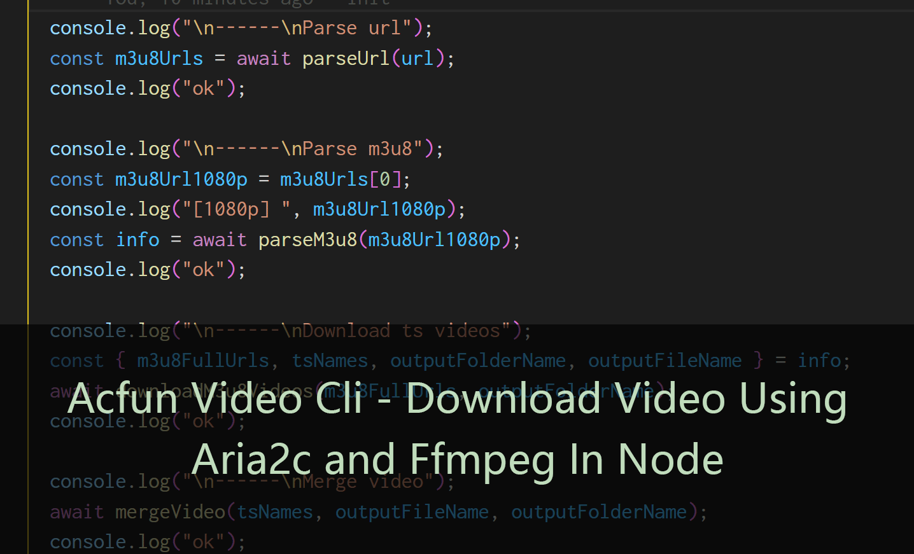

# 使用Node下载Acfun视频--解析A站视频API、aria2c多线程下载和ffmpeg合并

本文介绍如何使用Node实现下载Acfun视频，主要流程包括解析A站视频API，调用aria2c多线程下载m3u8分片和调用ffmpeg合并视频。

## 使用

系统需要先安装`aria2c`（deb包名为`aria2`）和`ffmpeg`

```sh
sudo apt install aria2 ffmpeg
```

全局安装本项目npm包`acfun-video-cli`，或者克隆本项目[czzonet/acfun-video-cli](https://github.com/czzonet/acfun-video-cli)编译运行

```sh
yarn global add acfun-video-cli
```

带视频url即可下载，下载内容在当前目录新的下载文件夹里，包括分片和合成的视频文件。

```sh
acfun-video-cli https://www.acfun.cn/v/ac4621380
```

运行结果：（省略部分用...表示）

```sh
------
Parse url
ok

------
Parse m3u8
1080p:  https://tx-safety-video.acfun.cn/mediacloud/acfun/acfun_video/hls/3HlXWWGOvsJ3D9Vhsn2QzbWPzp9OwtD40Yk9bk8v9t7Khv6leh44hGnw-Qqx9_KP.m3u8?pkey=AALA88Sf3Prmclff8_Ki5E0wlxj0Gam0_NN5bLvhUbCS2_88ypokmdH2Kf1wvzojL4pZJVjDn2m_iRkcrw-4hhRYEn5x01YOyfxYlJ9oOmeMtw4QA_UMZFq5MHQMp7BQZOkIFPPc7oBI0ABtWSSihiKp9WkKUklJibYCStx4Ego_u8MlOMaHONKAAivGjrCsrZap0sO3nuqV5-pThp_LE_WyXImXmfUSFbBkT3vLCWujKw&safety_id=AALdip3SIjwDZfuuv1y8iHA4
ok

------
Download ts videos

09/09 15:53:10 [NOTICE] Downloading 29 item(s)

...

Status Legend:
(OK):download completed.
ok

------
Parse url
ffmpeg version 4.2.4-1ubuntu0.1 Copyright (c) 2000-2020 the FFmpeg developers

...

Stream mapping:
  Stream #0:0 -> #0:0 (copy)
  Stream #0:1 -> #0:1 (copy)
Press [q] to stop, [?] for help
frame= 3000 fps=0.0 q=-1.0 size=   28160kB time=00:02:01.35 bitrate=1901.0kbits/s speed= 238x frame= 3520 fps=0.0 q=-1.0 Lsize=   33639kB time=00:02:22.36 bitrate=1935.7kbits/s speed= 243x    
video:31340kB audio:2223kB subtitle:0kB other streams:0kB global headers:0kB muxing overhead: 0.227712%
ok
```

## 开发

### 初始化

新建一个ts项目，添加一个入口文件index.ts。

新建`index.ts`

```ts
async function main() {}

main().then();
```

打开终端，安装node内置模块类型声明，后面会用到Node Api请求网络和文件操作等等

```sh
yarn add -D @types/node
```

解释：

- `-D`：类型声明只用于开发环境

### 解析A站视频API

解析A站视频API来获取视频不同清晰度的m3u8文件地址，请求视频url类似于：

```sh
https://www.acfun.cn/v/ac4621380?quickViewId=videoInfo_new&ajaxpipe=1
```

解释：

- `https://www.acfun.cn/v/ac4621380`：原视频地址
- `?quickViewId=videoInfo_new&ajaxpipe=1`：固定请求参数

返回一个比较乱的html文件，取出其中json部分进行解析成videoInfo对象。

```txt
{"html":"
<script class=\"videoInfo\">\n        window.pageInfo = window.videoInfo ={\"currentVideoId\":6291551,
……
,\"priority\":0}
</script>
<script class=\"videoResource\">\n        window.videoResource ={}</script>
<div class='left-column'>\n\n
……
```

解析：

- script标签里面的json就是视频的详细信息，切割出来解析成videoInfo对象。
- json是用`\`转义的，里面还嵌套一层json又被转义一次，所以对应去转义处理，把`\\"`，`\"`替换为`"`。

`videoInfo`部分接口格式

- `videoInfo`
  - `currentVideoInfo`
    - `ksPlayJson`：播放地址等信息的json字符串，解析出`ksPlay`对象

`ksPlay`部分接口格式

- `ksPlay`
  - `adaptationSet[0]`：可能是预留的不同版本，原先是对象，现在改成了一个元素的数组。
    - `representation`：不同清晰度的对象数组，清晰度由高到低。
      - `url`：m3u8链接
      - `qualityType`：清晰度，如1080p，720p

新建`api.ts`

```ts
import * as https from "https";

export async function getUrlData(url: string): Promise<string> {
  return new Promise((resolve, reject) => {
    https
      .get(url, (res) => {
        if (res === null) {
          reject(new Error("[E] No Response."));
        }

        const { statusCode } = res;
        const contentType = res.headers["content-type"];
        const allowTypes = [
          "application/json; charset=utf-8",
          "application/octet-stream",
          "application/vnd.apple.mpegurl",
        ];

        let error;
        if (statusCode !== 200) {
          error = new Error("[E] Response code: " + statusCode);
        } else if (
          !(contentType !== undefined && allowTypes.includes(contentType))
        ) {
          error = new Error(
            "[E] Invalid content-type.\n" +
              `Expected one of ${allowTypes} but received ${contentType}`
          );
        }

        if (error) {
          res.resume();
          reject(error);
        }

        res.setEncoding("utf8");
        let rawData = "";
        res.on("data", (chunk) => (rawData += chunk));

        res.on("close", () => {
          resolve(rawData);
        });
      })
      .on("error", (error) => {
        reject(new Error("[E] Https.Get error: " + error));
      });
  });
}
```

解释：

一个异步封装的简单的Node原生请求，用于获取网络数据。

- 引入`https`包
- 传入形参url
- 用Promise封装回调函数
- 发起get请求
- 检查响应，错误的处理
- 检查响应状态码和响应格式，错误的处理。如果有错要`res.resume()`来消耗完响应数据清除内存占用。
- 设置响应utf8编码
- 监听接收并拼接数据
- 监听关闭并返回数据
- Get请求错误的处理

新建`parser.ts`

```ts
import { getUrlData } from "./api";

export async function parseUrl(videoUrlAddress: string) {
  // eg https://www.acfun.cn/v/ac4621380?quickViewId=videoInfo_new&ajaxpipe=1
  const urlSuffix = "?quickViewId=videoInfo_new&ajaxpipe=1";
  const url = videoUrlAddress + urlSuffix;

  const raw: string = await getUrlData(url);

  // Split
  const strsRemoveHeader = raw.split("window.pageInfo = window.videoInfo =");
  const strsRemoveTail = strsRemoveHeader[1].split("</script>");
  const strJson = strsRemoveTail[0];

  const strJsonEscaped = escapeSpecialChars(strJson);
  /** Object videoInfo */
  const videoInfo = JSON.parse(strJsonEscaped);

  const ksPlayJson = videoInfo.currentVideoInfo.ksPlayJson;
  /** Object ksPlay */
  const ksPlay = JSON.parse(ksPlayJson);

  const representations: any[] = ksPlay.adaptationSet[0].representation;
  const urlM3u8s: string[] = representations.map((d) => d.url);

  return urlM3u8s;
}

/**
 * 去除JSON的一些转义 \\" -> \" ->"
 * @param str
 */
function escapeSpecialChars(str: string) {
  return str.replace(/\\\\"/g, '\\"').replace(/\\"/g, '"');
}
```

解析：

- 引入`getUrlData`函数访问网络数据
- 接受形参视频地址url
- 添加请求url后缀
- 请求得到原始数据
- 切头去尾，得到`videoInfoJson`
- 反转义Json字符串
- 解析Json得到`videoInfo`对象
- 提取`videoInfo`对象`ksPlayJson`属性，解析得到`ksPlay`对象
- 提取`ksPlay`对象`representations`属性，得到不同清晰度的数组
- 返回不同清晰度的链接的数组

修改`index.ts`，在`main`函数里添加 ：

```ts
  const url = `https://www.acfun.cn/v/ac4621380`;
  console.log("\n------\nParse url");
  const m3u8Urls = await parseUrl(url);
  console.log("ok");
```

解释：

- 示例视频地址
- 调用`parseUrl`函数解析所有清晰度的m3uu8播放地址。

### 调用aria2c多线程下载m3u8分片

首先，选一个清晰度的m3u8链接下载，比如1080p，然后下载并解析m3u8文件，提取下载链接数组，最后调用aria2c多线程下载。

#### 解析m3u8文件

修改`parser.ts`，添加：

```ts
export async function parseM3u8(m3u8Url: string) {
  const m3u8File = await getUrlData(m3u8Url);
  /** 分离ts文件链接 */
  const rawPieces = m3u8File.split(/\n#EXTINF:.{8},\n/);
  /** 过滤头部 */
  const m3u8RelativeLinks = rawPieces.slice(1);
  /** 修改尾部 去掉尾部多余的结束符 */
  const patchedTail = m3u8RelativeLinks[m3u8RelativeLinks.length - 1].split(
    "\n"
  )[0];
  m3u8RelativeLinks[m3u8RelativeLinks.length - 1] = patchedTail;

  /** 完整链接，直接加m3u8Url的通用前缀 */
  const m3u8Prefix = m3u8Url.split("/").slice(0, -1).join("/");
  const m3u8FullUrls = m3u8RelativeLinks.map((d) => m3u8Prefix + d);
  /** aria2c下载的文件名，就是取url最后一段，去掉末尾url参数(?之后是url参数) */
  const tsNames = m3u8RelativeLinks.map((d) => d.split("?")[0]);
  /** 文件夹名，去掉文件名末尾分片号 */
  let outputFolderName = tsNames[0].slice(0, -9);
  /** 输出最后合并的文件名，加个通用mp4后缀 */
  const outputFileName = outputFolderName + ".mp4";

  return {
    m3u8FullUrls,
    tsNames,
    outputFolderName,
    outputFileName,
  };
}
```

解释：

- 接受形参m3u8文件地址url
- 下载m3u8文件
- 分离ts文件链接
- 去掉多余头部
- 修改尾部 去掉尾部多余的结束符
- 得到相对地址数组
- 生成完整地址数组，需要添加`m3u8Url`相同的前缀
- 生成`aria2c`下载的文件名，就是取url最后一段，去掉末尾url参数(?之后是url参数)
- 生成文件夹名，去掉文件名末尾分片号
- 生成最后合并的文件名，加个通用mp4后缀
- 返回生成的信息

#### 调用aria2c多线程下载

安装`aria2c`

```sh
sudo apt install aria2
```

新建`runShell.ts`

```ts
import { spawn } from "child_process";

/**
 * 执行shell命令
 * @param command 执行的shell
 * @param args shell参数
 * @param options shell选项
 * @description  
例子：

​```ts
readUpdateOutputFromShell("sar", ["-n", "DEV", "1"])
​```
 */
export const runShell = async (
  command: string,
  args: readonly string[],
  options: ShellOption
) =>
  new Promise((resolve, reject) => {
    const runpProcess = spawn(command, args, {
      stdio: "inherit",
      cwd: options.cwd ? options.cwd : process.cwd(),
      env: process.env,
      detached: true,
    });

    /** 结束处理 */
    runpProcess.on("close", (code) => {
      resolve();
    });
  });

type ShellOption = {
  cwd?: string;
};
```

解释：

一个Node调用子线程执行系统命令的简单异步封装

- 引入`spawn`函数
- `stdio: "inherit"`：直接使用父线程的stdio，stderr。
- `cwd: options.cwd`：命令执行路径设为默认运行的路径

新建`video.ts`

```ts
import * as fs from "fs";
import * as path from "path";
import { runShell } from "./runShell";

export async function downloadM3u8Videos(
  m3u8FullUrls: string[],
  outputFolderName: string
) {
  // 检查下载文件夹名
  if (outputFolderName == "") {
    throw new Error("[E] Download folder name is empty.");
  }
  /** 已存在需要重名文件夹 加后缀_避免冲突 */
  while (fs.existsSync(path.resolve(process.cwd(), outputFolderName))) {
    outputFolderName += "_";
    if (outputFolderName.length > 100) {
      throw new Error(
        "[E] Download folder exists and try to rename too many times."
      );
    }
  }

  /** 新建下载文件夹 在当前运行目录下 */
  const outPath = path.resolve(process.cwd(), outputFolderName);
  fs.mkdirSync(outPath);

  /** 写入下载链接列表文件 */
  fs.writeFileSync(path.resolve(outPath, "urls.txt"), m3u8FullUrls.join("\n"));

  /** aria2c多线程下载 */
  await runShell("aria2c", ["-i", "./urls.txt"], {
    cwd: path.resolve(outPath),
  });
}
```

解释：

- 检查下载文件夹名，为空报错
- 已存在需要重名文件夹，加后缀_避免冲突
- 新建下载文件夹，文件夹新建在当前运行目录下
- 写入下载链接列表文件`urls.txt`
- `aria2c`读取`urls.txt`进行多线程下载到下载文件夹，同时下载任务数可以由-j参数指定（默认5）

修改`index.ts`，添加到`main`函数

```ts
  console.log("\n------\nParse m3u8");
  const m3u8Url1080p = m3u8Urls[0];
  const info = await parseM3u8(m3u8Url1080p);
  console.log("ok");

  console.log("\n------\nDownload ts videos");
  const { m3u8FullUrls, tsNames, outputFolderName, outputFileName } = info;
  await downloadM3u8Videos(m3u8FullUrls, outputFolderName);
  console.log("ok");
```

解释：

- 选取一个1080p清晰度的链接，解析下载所需的信息
- 下载所有ts视频文件链接到对应下载文件夹

### 调用ffmpeg合并视频

安装`ffmpeg`

```sh
sudo apt install ffmpeg
```

`ffmpeg`合并视频使用如下指令：参考官方wiki[Concatenate – FFmpeg](https://trac.ffmpeg.org/wiki/Concatenate)

```sh
ffmpeg -f concat -safe 0 -i ./files.txt -c copy outputFileName
```

解释：

- `ffmpeg`：使用ffmpeg处理视频。
- `-f concat`：强制格式使用虚拟连接脚本解码器concat，用来读取相同格式的文件合并输入并拼接。
- `-safe 0`：忽略文件路径安全检查。
- `-i ./files.txt`：输入文件，包含特定格式指定多个视频和参数，具体格式如下。
- `-c copy`：复制视频音频流，不做处理。
- `outputFileName`：输出文件的名称。

`files.txt`格式如下

```txt
file /path/xxx1
file /path/xxx2
...
```

解释：

- 指定要读取的文件路径，多个文件多行分割。

编辑`video.ts`，添加

```ts
export async function mergeVideo(
  tsNames: string[],
  outputFileName: string,
  outputFolderName: string
) {
  const outPath = path.resolve(process.cwd(), outputFolderName);

  /** 合并参数列表 格式file path */
  const concatStrs = tsNames.map((d) => `file '${outPath}/${d}'`);
  /** 写入合并参数列表文件 */
  fs.writeFileSync(path.resolve(outPath, "files.txt"), concatStrs.join("\n"));
  debugger;

  /** ffmpeg合并 */
  await runShell(
    "ffmpeg",
    [
      "-f",
      "concat",
      "-safe",
      "0",
      "-i",
      "./files.txt",
      "-c",
      "copy",
      outputFileName,
    ],
    { cwd: path.resolve(outPath) }
  );
}
```

解释：

- 形参：ts视频文件名数组，合并输出的文件名，合并的文件夹名
- 获取下载文件夹路径
- 合并参数列表 格式`file path `
- 写入合并参数列表文件
- `ffmpeg`合并

编辑`index.ts`，在`main`函数新增：

```ts
  console.log("\n------\nMerge video");
  await mergeVideo(tsNames, outputFileName, outputFolderName);
  console.log("ok");
```

运行即可。

### 改为用户输入url

修改`index.ts`：

```ts
  const url = process.argv[2];
  console.log("Your input: ", url);
  if (typeof url !== "string") {
    console.log("[E] Url input required.");
    return;
  }
  if (url.match(/^https:\/\/www\.acfun\.cn\/v\/ac\d+$/) === null) {
    console.log(
      "[E] Url input invalid.Valid input example: https://www.acfun.cn/v/ac4621380"
    );
    return;
  }
```

解释：

- 读取用户输入参数url
- 无输入，则错误返回
- 输入格式不匹配，则错误返回

最终的`index.ts`：

```ts
import { parseUrl, parseM3u8 } from "./parser";
import { downloadM3u8Videos, mergeVideo } from "./video";

async function main() {
  const url = process.argv[2];
  console.log("Your input: ", url);
  if (typeof url !== "string") {
    console.log("[E] Url input required.");
    return;
  }
  if (url.match(/^https:\/\/www\.acfun\.cn\/v\/ac\d+$/) === null) {
    console.log(
      "[E] Url input invalid.Valid input example: https://www.acfun.cn/v/ac4621380"
    );
    return;
  }

  console.log("\n------\nParse url");
  const m3u8Urls = await parseUrl(url);
  console.log("ok");

  console.log("\n------\nParse m3u8");
  const m3u8Url1080p = m3u8Urls[0];
  console.log("[1080p] ", m3u8Url1080p);
  const info = await parseM3u8(m3u8Url1080p);
  console.log("ok");

  console.log("\n------\nDownload ts videos");
  const { m3u8FullUrls, tsNames, outputFolderName, outputFileName } = info;
  await downloadM3u8Videos(m3u8FullUrls, outputFolderName);
  console.log("ok");

  console.log("\n------\nMerge video");
  await mergeVideo(tsNames, outputFileName, outputFolderName);
  console.log("ok");
}

main().then();
```

至此，整个流程已经完成了。

## 总结

本文通过一步步介绍解析A站视频API，调用`aria2c`多线程下载m3u8分片和调用`ffmpeg`合并视频，实现了使用Node实现下载Acfun视频的功能。

另外，`ffmpeg`本身也可以单线程直接下载m3u8链接进行合并，使用命令：

```sh
ffmpeg -i 'https://xxx.m3u8' -c copy output.mp4
```

方便图简单的童鞋使用。

如果不喜欢这篇文档，点击右上角关闭按钮。如果喜欢也觉得有用，欢迎点赞支持，写下评论分享你的看法。项目源码，戳~[czzonet/acfun-video-cli](https://github.com/czzonet/acfun-video-cli)

## 参考

1. [ffmpeg Documentation](https://ffmpeg.org/ffmpeg.html)
2. [FFmpeg Formats Documentation](https://ffmpeg.org/ffmpeg-formats.html#concat)
3. [Concatenate – FFmpeg](https://trac.ffmpeg.org/wiki/Concatenate)
4. [aria2c(1) — aria2 1.35.0 documentation](https://aria2.github.io/manual/en/html/aria2c.html#input-file)
5. [HTTP | Node.js v14.9.0 Documentation](https://nodejs.org/dist/latest-v14.x/docs/api/http.html#http_http_get_options_callback)

## 法律问题

如果您对本软件的使用构成侵犯版权的基础，或您将本软件用于任何其他非法目的，作者不承担任何责任。

This software is distributed under the [Apache-2.0 license](https://raw.github.com/czzonet/acfun-video-cli/master/LICENSE).

In particular, please be aware that

> THE SOFTWARE IS PROVIDED "AS IS", WITHOUT WARRANTY OF ANY KIND, EXPRESS OR IMPLIED, INCLUDING BUT NOT LIMITED TO THE WARRANTIES OF MERCHANTABILITY, FITNESS FOR A PARTICULAR PURPOSE AND NONINFRINGEMENT. IN NO EVENT SHALL THE AUTHORS OR COPYRIGHT HOLDERS BE LIABLE FOR ANY CLAIM, DAMAGES OR OTHER LIABILITY, WHETHER IN AN ACTION OF CONTRACT, TORT OR OTHERWISE, ARISING FROM, OUT OF OR IN CONNECTION WITH THE SOFTWARE OR THE USE OR OTHER DEALINGS IN THE SOFTWARE.

Translated to human words:

*In case your use of the software forms the basis of copyright infringement, or you use the software for any other illegal purposes, the authors cannot take any responsibility for you.*

We only ship the code here, and how you are going to use it is left to your own discretion.


